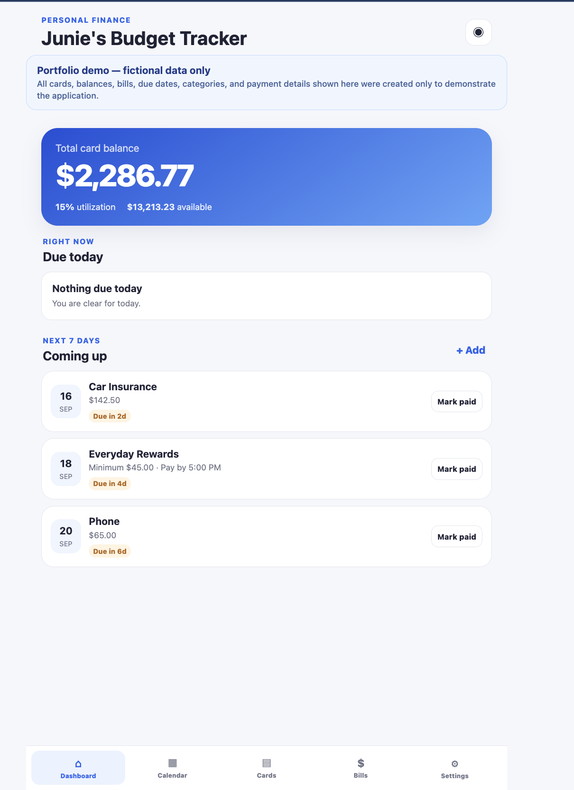
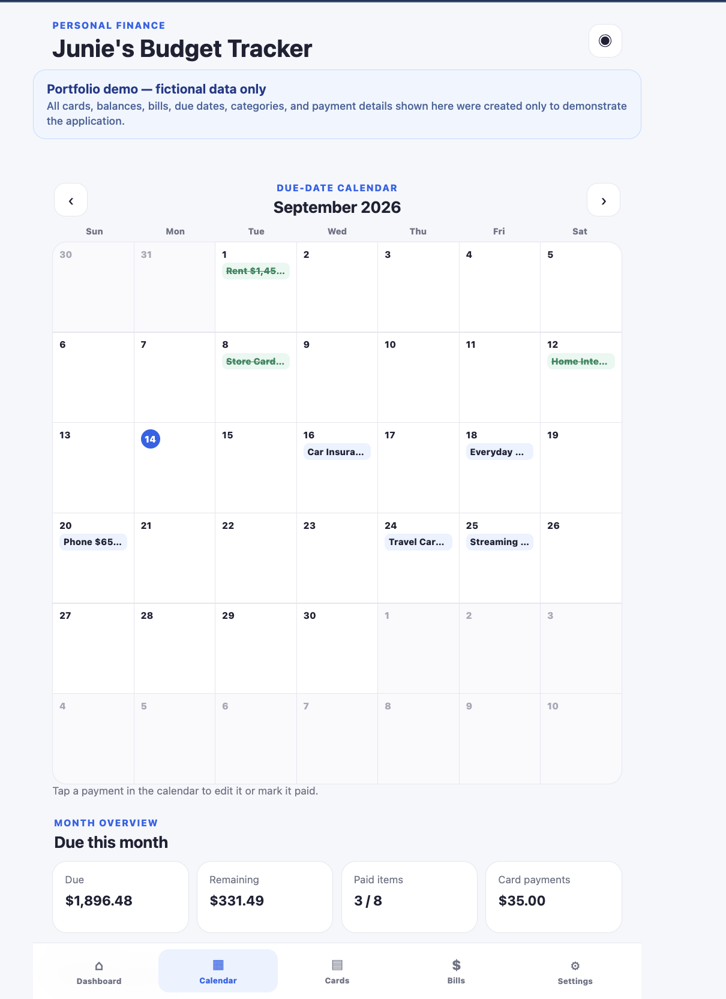
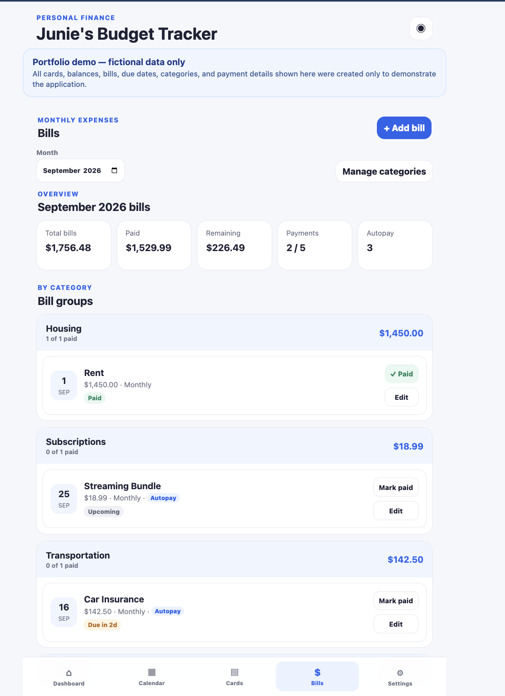
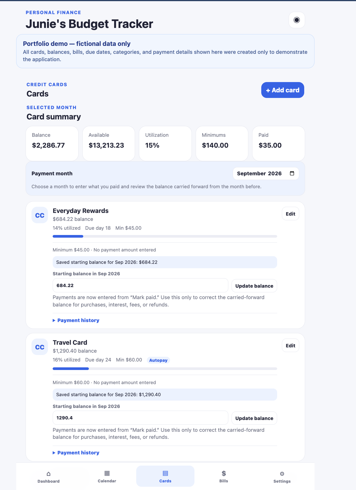

# Junie's Budget Tracker

Junie's Budget Tracker is a private, mobile-first budgeting web app for managing credit-card balances, recurring bills, due dates, payment status, and monthly planning.

The project focuses on making day-to-day bill tracking simple while keeping sensitive financial data out of the source code and off a remote database.

## Live demo

**[Open the portfolio demo](https://junies-budget-tracker.vercel.app/demo.html)**

The portfolio demo is preloaded with **fictional cards, balances, bills, payment amounts, due dates, and categories** so the application's calculations and monthly workflows can be explored without exposing real financial information. Demo data uses a separate browser-storage key from the normal tracker.

## Screenshots

| Dashboard | Calendar |
| --- | --- |
|  |  |
| **Bills** | **Cards** |
|  |  |

The demo showcases credit utilization, upcoming payments, a month-based payment calendar, category-grouped bills, autopay indicators, carried-forward card balances, and per-month payment tracking.

## Tech stack

- HTML5
- CSS3
- Vanilla JavaScript
- localStorage
- Progressive Web App (PWA) manifest
- Service worker for offline support
- Vercel deployment

## Key features

- Dashboard showing total credit-card balance, available credit, utilization, amount due, remaining amount, paid count, and next payment
- Add and edit credit cards
- Track balances, credit limits, utilization, minimum payments, and due dates
- Record monthly credit-card payment amounts and carry balances forward between months
- Add recurring or one-time bills with categories and multiple recurrence patterns
- Monthly due-date calendar and agenda
- Per-month paid/unpaid status
- Automatic payment states such as upcoming, due soon, due today, overdue, and paid
- Separate credit-card and bill management views
- Optional payment cutoff times and autopay tracking
- Browser notification reminders while the app is active
- Balance privacy toggle
- JSON backup export/import
- Responsive mobile-first interface
- PWA support and offline service worker

## Data and privacy

Financial data is stored locally in the browser using `localStorage`. The repository contains application code only.

Do not enter full credit-card numbers, passwords, CVVs, bank account numbers, or other credentials.

Because browser storage can be cleared, the app includes JSON backup/export functionality so users can preserve or move their data.

## How monthly tracking works

Each credit card and bill can be associated with a due date. The app builds a month-specific payment schedule, calculates outstanding amounts, and keeps payment status separate by month so recurring expenses can be tracked over time.

Credit-card payment amounts can be recorded by month, and balances can carry forward automatically while still allowing month-specific overrides. The dashboard also calculates credit utilization from stored balances and credit limits.

## Run locally

Serve the project with any basic local web server. For example:

```bash
python3 -m http.server 8000
```

Then open `http://localhost:8000`.

## Deployment

The project is deployed as a static site on Vercel and is connected to the GitHub repository for automatic deployments from `main`.

## What this project demonstrates

This project demonstrates JavaScript state management, financial calculations, date and recurrence handling, local persistence, responsive UI design, offline/PWA concepts, privacy-conscious application design, and iterative development around a practical personal workflow.
